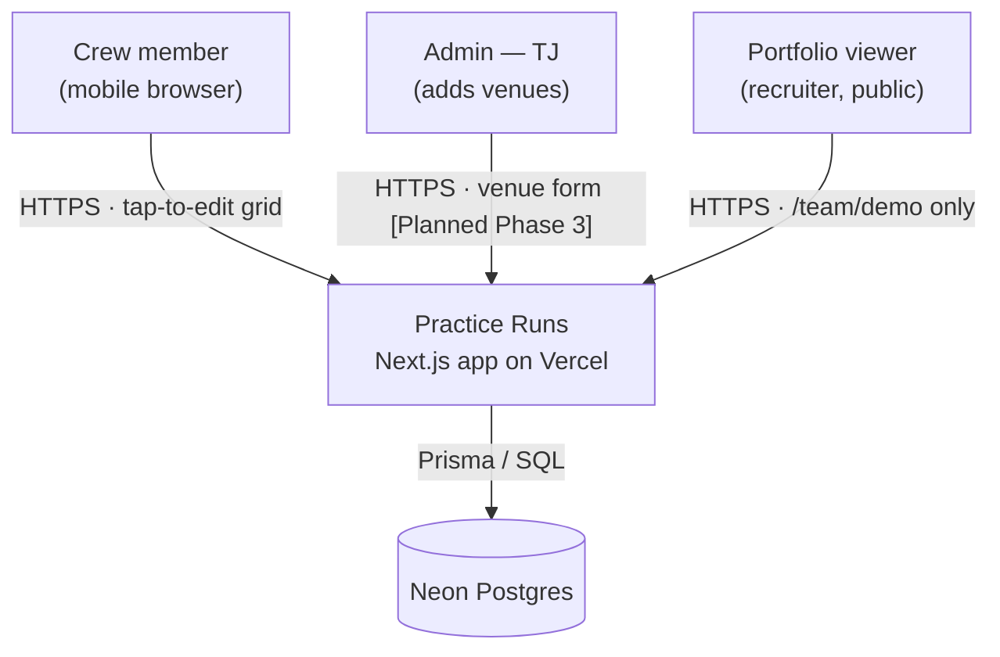
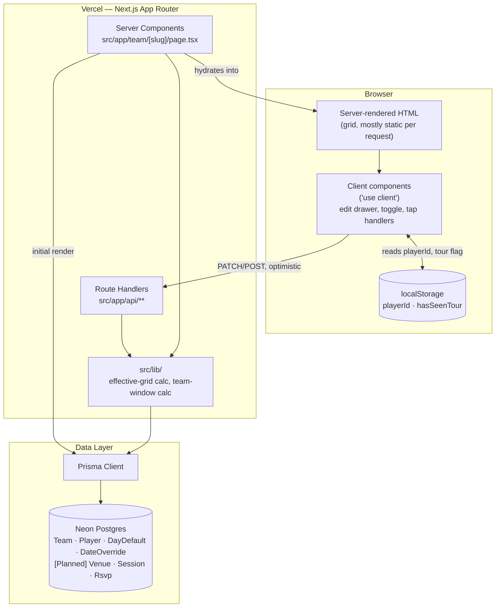
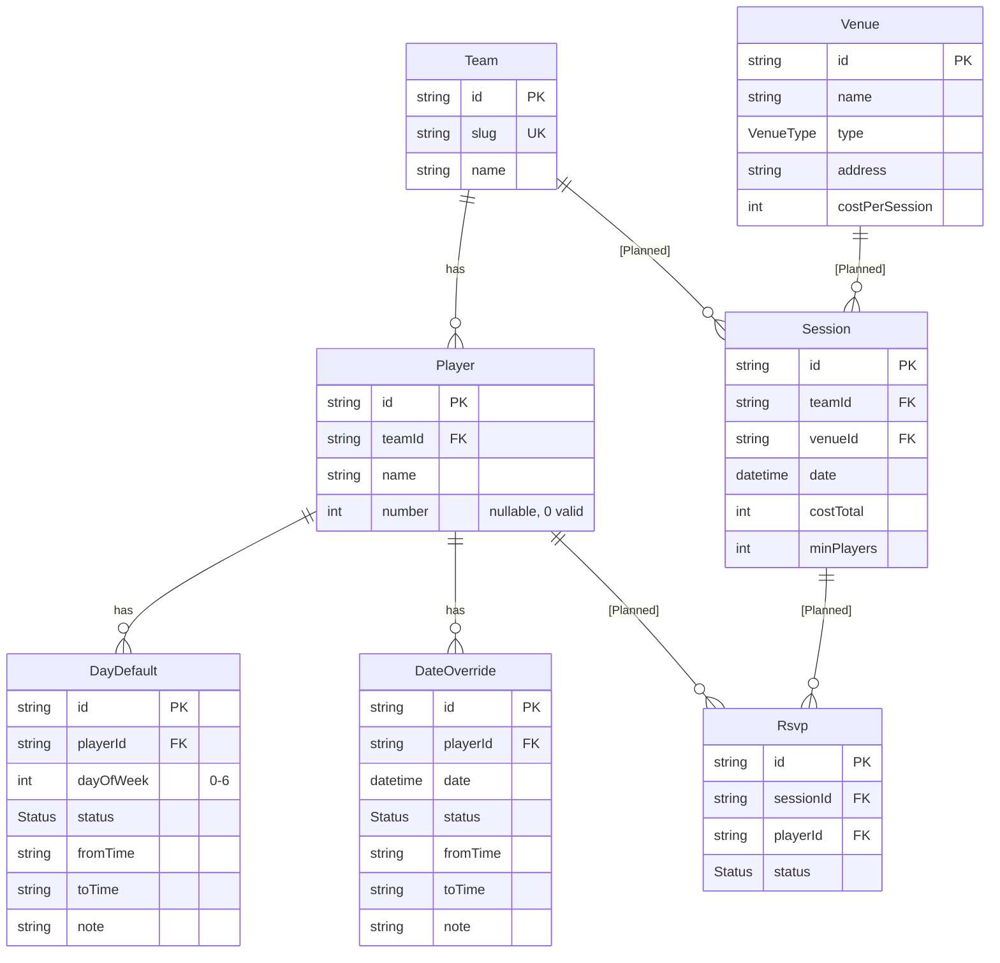
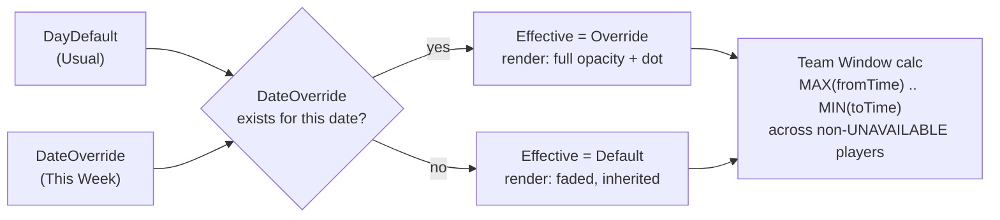
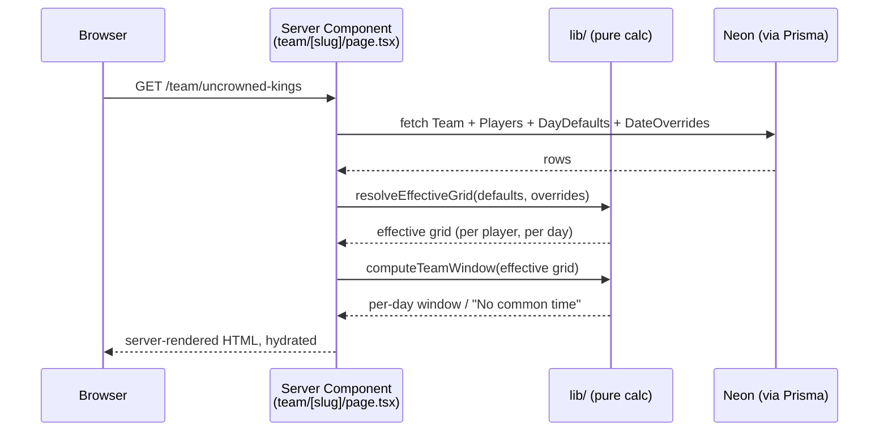
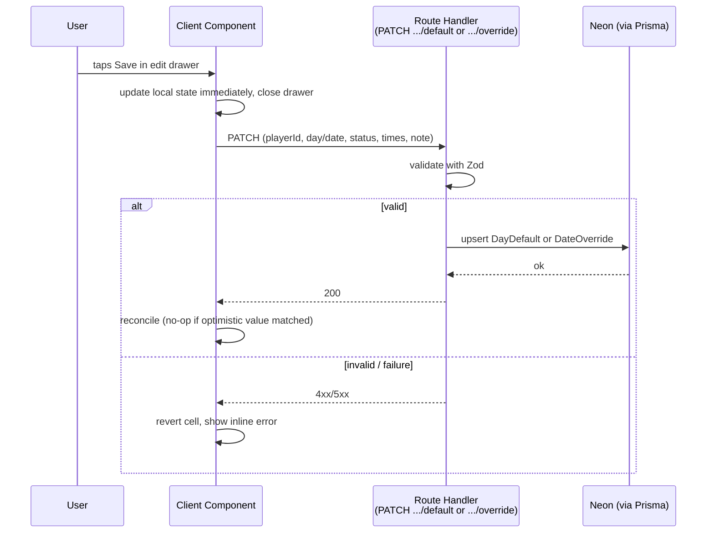
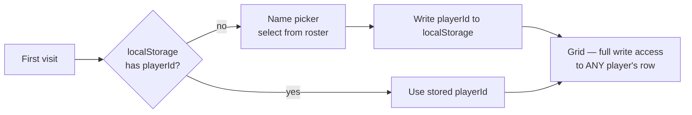
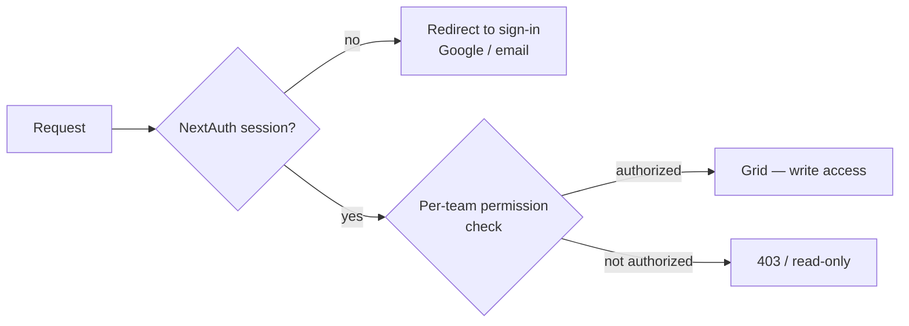

# Practice Runs — Architecture

> System-level architecture and architecture decisions. This is the single place to look for *how the system is built and why* — not what it does (that's `practiceRuns-ProjectOverview.md`) and not the visual brainstorm (`practiceRuns-ProjectPlan.html`).
>
> Scope: covers the full planned system through Phase 5, including subsystems not yet built. Anything not yet implemented is marked **`[Planned]`**.
>
> Status: Phase 1 (core availability grid) shipped. Phase 2 not started. Update this file when an architecture decision changes — don't let it drift from what's actually built.

---

## 1. Guiding Principles

These are the architectural biases behind every decision below. When a new decision needs to be made, default to these.

1. **Monolith over services.** One Next.js app, one database. ~15 users doesn't justify service boundaries, queues, or separate deployables.
2. **Server-first.** React Server Components and direct Prisma reads by default; `'use client'` and API routes only where interactivity or a real integration boundary requires them.
3. **Read-time computation over stored derived state.** "Effective schedule" (Usual + This Week override) and "Team window" are computed on every read, never persisted. One source of truth per fact.
4. **Trust over enforcement (V1).** No auth, no permission checks — client-stored identity, matching how the spreadsheet already worked. Real access control is a deferred, gated addition, not a missing feature.
5. **Optimistic over confirmed.** The UI updates before the network call resolves. Reconciliation and revert-on-failure are the exception path, not the common one.
6. **Decoupled bounded contexts.** Recurring availability (grid) and one-off session planning (Sessions/Venues) are separate data models and separate subsystems, even though they live in the same app and database.
7. **Manual over real-time.** No websockets, no polling, no subscriptions. Pull-to-refresh and refetch-on-focus are sufficient at this scale.

---

## 2. System Context

Who/what talks to the system, at the highest level.



**Notes:**
- There is exactly one deployed app instance serving both the real team (`/team/uncrowned-kings`, URL never posted publicly) and the seeded demo team (`/team/demo`) — same codebase, same database, differentiated by `Team.slug`, not by environment. See [§9](#9-deployment-architecture).
- No third-party auth provider, no external APIs in V1. `[Planned]` Phase 5 adds NextAuth (Google/email) as an external identity provider dependency.

---

## 3. Container / Component Architecture

Inside the Vercel-hosted app, the structural boundaries:



**Why this shape:**
- **Server Components fetch directly with Prisma** — no API round-trip for the initial grid render (see `coding-standards.md`). API routes exist only for the client-initiated *writes* (cell edits, add-player) and any future integration surface (webhooks, Phase 5 auth callbacks).
- **`src/lib/` holds the two pieces of real domain logic** — effective-grid resolution (override-falls-back-to-default) and team-window calculation (MAX/MIN overlap). Both are pure functions over data already fetched, callable from Server Components and API routes alike, so the logic exists in exactly one place.
- **`localStorage` is a genuine architectural boundary**, not an implementation detail: it's the entire identity subsystem for V1. No server-side session, no cookie, no JWT.

---

## 4. Data Architecture

### 4.1 Entity relationships



Two bounded contexts share the database but never join across each other: **{Team, Player, DayDefault, DateOverride}** (recurring availability) and **{Venue, Session, Rsvp}** (`[Planned]` one-off sessions). `Session.teamId` and `Rsvp.playerId` are the only links between them — deliberate, see [§7](#7-decision-log-architecture-relevant-only).

### 4.2 Read-time computation, not stored derived state

The "Effective Schedule" a player sees is never written to the database — it's computed on every `GET`:



**Invariant enforced by this design:** a missing `DateOverride` row *means* "use the default" — there is no tri-state "unset" to reconcile, and no write-time job to keep two tables in sync.

### 4.3 Storage strategy by phase

| Phase | What's added | Why not sooner / all at once |
|---|---|---|
| 1 | Neon + Prisma, `Team`/`Player`/`DayDefault` | DB from day one — the spreadsheet already proved multi-user structured data is required; no reason to prototype in-memory first |
| 2 | `DateOverride` | Needs Phase 1's grid interaction proven before adding a second write target |
| 3 `[Planned]` | `Venue`, `Session`, `Rsvp` | Deliberately deferred — validates the core tap-to-edit interaction on real usage before adding a second bounded context |
| 5 `[Planned]` | NextAuth tables (accounts/sessions) via Prisma adapter | Only added once the Phase 5 trigger is met — see [§6](#6-identity--auth-architecture) |

---

## 5. Request / Data Flow

### 5.1 Read path — loading the grid



No API route is involved in the initial render — this is the "fetch data directly in server components" rule from `coding-standards.md` applied concretely.

### 5.2 Write path — optimistic cell edit



The **write target is chosen by which endpoint is called**, not by branching logic in one endpoint — `/default` vs `/override` — which is the server-side expression of the "one grid, toggle changes write target" decision.

**Reverting an override:** `DELETE .../override?date=YYYY-MM-DD` is the inverse of the override `PATCH` — it removes the `DateOverride` row (`deleteMany`, idempotent) rather than writing a sentinel "unset" value, so the read path's existing fallback (missing row → use `DayDefault`) handles it with no special-casing. Same optimistic-then-reconcile shape as the write path above: the edit drawer's "Reset to Usual" button flips the cell back to its inherited value immediately, then confirms against the server.

---

## 6. Identity & Auth Architecture

### 6.1 V1–V4: client-stored identity, no server-side auth



There is no session, no server-side identity check on any write. `playerId` sent with a `PATCH` is trusted as-is. This is a conscious trust boundary, not an oversight — matches the spreadsheet's existing trust model for a ~15-person group.

**Portfolio exposure is solved architecturally by data isolation, not access control:** `/team/demo` is a distinct `Team` row with seeded fake `Player` rows, reset by a scheduled job `[Planned Phase 4]`. A recruiter hitting `/team/demo` cannot reach the real team's rows — there's no shared row to protect, so there's nothing for auth to gate.

### 6.2 `[Planned Phase 5]` — gated addition, not a redesign



**Trigger condition (not a date):** opening the app to people outside TJ's direct trust circle. Until then this diagram describes intent only — no NextAuth dependency, schema, or middleware exists yet. When it lands, it adds a session check in front of the existing write path in [§5.2](#52-write-path--optimistic-cell-edit); it does not change the data model for `DayDefault`/`DateOverride`, only who is allowed to call the endpoints that touch them.

---

## 7. Decision Log (architecture-relevant only)

The product/UX decisions log lives in `practiceRuns-ProjectOverview.md`. This table covers only decisions that shaped the *system* architecture.

| Decision | Alternative considered | Why this one |
|---|---|---|
| Monolithic Next.js app, single Postgres DB | Separate API service, or per-feature services | ~15 users; service boundaries would add deployment/ops cost with no scaling benefit |
| Server Components fetch directly via Prisma for reads | All data access through API routes | Avoids a redundant network hop for the common case (viewing the grid); API routes reserved for actual write/integration boundaries |
| Effective grid & team window computed at read time | Store a materialized "effective" table, updated on write | One source of truth; no sync job, no risk of stale derived data |
| Client-stored identity (`localStorage`), no server session | NextAuth from day one | Zero auth build cost for a trust-based group of 15; revisit only when the group boundary actually changes |
| Optimistic writes with client-side revert | Confirm-then-render (wait for server before updating UI) | Save failures are rare and reversible; optimism matches the "few taps, no friction" product goal |
| Sessions/Venues as a separate data model (own tables, only weak FK links to Team/Player) | Extend `DayDefault`/`DateOverride` with session-like fields | The two features don't share state or lifecycle; coupling them would force the grid schema to carry Sessions' concerns (cost, RSVP, headcount) permanently |
| Manual pull-to-refresh / refetch-on-focus | WebSocket or polling-based real-time sync | No evidence of a staleness problem at this scale; real-time infra is pure added complexity until it's a real complaint |
| Prisma + `prisma migrate dev` (not `db push`) | Schema-less or push-based migrations | Explicit, reviewable migration history matters even for a small app — see `coding-standards.md` |
| Demo team as data isolation (`Team.slug = "demo"`) | Auth/login wall in front of the whole app | Solves the actual risk (recruiter mutates real data) without adding auth scope to Phase 1 |
| Availability grid as CSS Grid + ARIA `role="grid"` pattern (`div[role=table/row/columnheader/rowheader/cell]`) | Semantic HTML `<table>` (original Phase 1/2 implementation) | `<table>`/`table-fixed` layout didn't give per-breakpoint column control; CSS Grid does, while the explicit ARIA roles preserve the same screen-reader table semantics a real `<table>` would have provided |

---

## 8. Cross-Cutting Concerns

| Concern | Approach | Notes |
|---|---|---|
| **Validation** | Zod schemas at every Server Action / API route boundary | Per `coding-standards.md`; server components trust Prisma's return types internally |
| **Error handling** | Try/catch in actions/routes, `{ success, data, error }` return shape, revert-and-inline-error on the client | No toasts/modals — the reverted cell + inline message *is* the error UI |
| **Consistency** | No distributed transactions needed (single DB); Prisma transactions used only for multi-row writes (e.g. `[Planned]` Rsvp + Session count checks) | |
| **Sync/staleness** | Pull-to-refresh + refetch-on-focus only | Explicitly not real-time — see [§1](#1-guiding-principles) principle 7 |
| **Accessibility** | Availability grid uses explicit ARIA `role="grid"` markup (table/row/columnheader/rowheader/cell) over CSS Grid, not a bare `<div>` soup | Keeps screen-reader table semantics equivalent to a real `<table>` while allowing the responsive column sizing a `<table>` couldn't give at the ~15-row demo roster size |
| **Security posture (V1)** | No auth; trust-based; portfolio risk handled by data isolation, not access control | Re-evaluate only at the Phase 5 trigger |
| **Scalability** | Not a design goal — Vercel + Neon serverless defaults are already far beyond a 15-person group's needs | No caching layer, no CDN-level data caching planned |
| **Observability** | Vercel default request logs; no APM/tracing planned | Reconsider if Sessions (Phase 3) introduces payment-adjacent logic worth auditing |

---

## 9. Deployment Architecture

```mermaid
graph TB
    subgraph Vercel["Vercel (single project)"]
        Prod["Production deployment<br/>main branch"]
    end
    subgraph NeonProj["Neon Project"]
        DB[("Postgres<br/>Team rows: uncrowned-kings · demo")]
    end
    Prod -->|"DATABASE_URL"| DB
    RealURL["/team/uncrowned-kings<br/>URL never posted publicly"] -.-> Prod
    DemoURL["/team/demo<br/>linked from portfolio/GitHub"] -.-> Prod
    Cron["`[Planned Phase 4]`<br/>Vercel Cron — daily reset job"] -->|reseeds| DB
```

One environment, one database, differentiated by row data (`Team.slug`) rather than by infrastructure. `prisma migrate deploy` runs before the app starts in production, per `coding-standards.md`.

---

## 10. Non-Goals (explicitly rejected architectures)

Documented so they aren't re-proposed without a reason to revisit:

- **Microservices / separate backend service** — no scaling or team-boundary justification at this size.
- **Real-time sync (WebSockets, SSE, polling)** — see principle 7; would add persistent-connection infra for a staleness problem that doesn't exist yet.
- **Mobile native app** — mobile-first responsive web covers the "phone in hand, courtside" use case without a second codebase.
- **Auth-as-default** — see [§6](#6-identity--auth-architecture); adding it before the trigger is met would be scope the group doesn't need.
- **Merging Sessions/Venue tables into the availability grid schema** — see [§7](#7-decision-log-architecture-relevant-only) and `AGENTS.md`'s "Do NOT" list.
- **Materialized/cached "effective grid" table** — see [§4.2](#42-read-time-computation-not-stored-derived-state); the read-time computation is cheap enough at this data volume that caching would be premature.

---

## 11. Architecture Evolution by Phase

```mermaid
gantt
    dateFormat X
    axisFormat %s
    section Phase 1
    Next.js + Prisma + Neon, RSC reads, DayDefault only :done, p1, 0, 1
    section Phase 2
    DateOverride + read-time effective/window calc :p2, 1, 2
    section Phase 3 [Planned]
    Venue/Session/Rsvp bounded context added :p3, 2, 3
    section Phase 4 [Planned]
    Demo team isolation + Cron reset job :p4, 3, 4
    section Phase 5 [Planned, gated]
    NextAuth session layer in front of existing write paths :p5, 4, 5
```



Each phase is additive to the architecture described above — no phase requires re-architecting a prior one. If a future phase *would* require that, treat it as a signal to update this document and get explicit sign-off before building.

---

_Companion to `practiceRuns-ProjectOverview.md` (product/spec source of truth) and `practiceRuns-ProjectPlan.html` (visual brainstorm). Update this file whenever an architecture decision is made or changed — don't let it drift from what's actually built._
